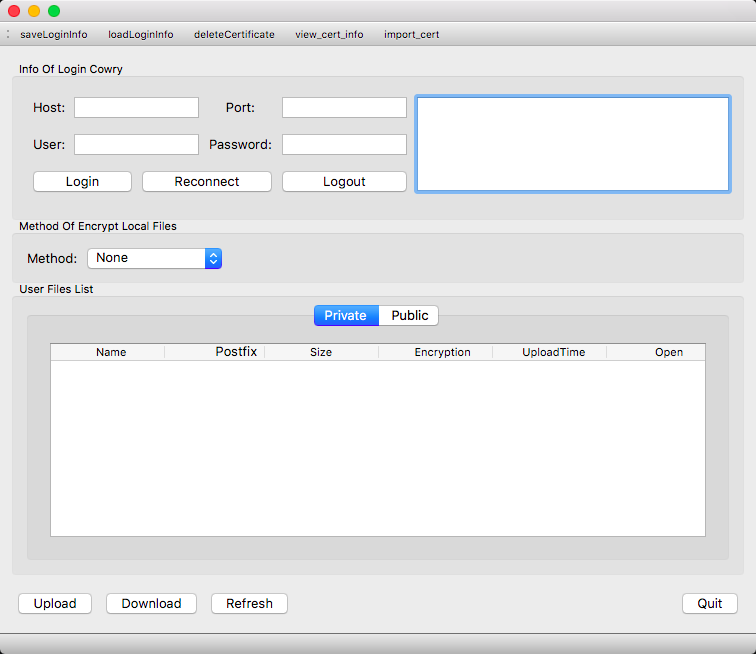

# Cowry: A Secure Distributed FTP System (Beta)

[![PyPI version]][PyPI]

[![Build Status]][Travis CI]

[](https://www.codacy.com/app/yxwzaxns/cowry?utm_source=github.com&utm_medium=referral&utm_content=yxwzaxns/cowry&utm_campaign=badger)
[](https://codeclimate.com/github/yxwzaxns/cowry)



## Introduction

Cowry is an open source project to transfer files security.

## Features
* Encryption base on TLS
* Encrypt local files in a variety of ways
* Not need to leave a password to share files securely
* Friendly interface


## Install Cowry Server
### Standard mode ( all in one )
```

git clone https://github.com/yxwzaxns/cowry.git

cd cowry/server

pip3 install -r requirements.txt

python3 server.py -n

python3 server.py -s

```
### Distributed mode
```

git clone https://github.com/yxwzaxns/cowry.git

cd cowry/server

docker-compose build

docker-compose up

```


## Usage
```
git clone https://github.com/yxwzaxns/cowry.git

cd cowry/client

pip3 install -r requirements.txt

python3 client.py
```

## Contributing
Welcome to Contribute code to this project, Please make sure to read the [GitFlow](https://datasift.github.io/gitflow/IntroducingGitFlow.html) Guide before making a pull request.

## License
[MIT](https://opensource.org/licenses/MIT)
